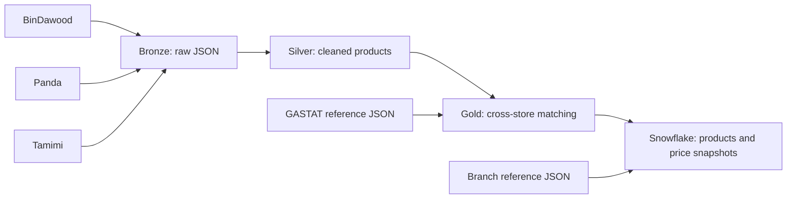

# Saudi Grocery Tracker

A data engineering pipeline for collecting, standardizing, and comparing grocery prices across **BinDawood, Panda, and Tamimi Markets** in Saudi Arabia. It matches products across retailers, aligns fruits and vegetables with GASTAT reference data, and stores price snapshots in Snowflake for analysis over time.

مشروع لجمع أسعار البقالة من بن داود وبنده وأسواق التميمي، وتنظيف البيانات ومطابقة المنتجات بين المتاجر، وربط الخضار والفواكه ببيانات الهيئة العامة للإحصاء.

**Stack:** Python · Apache Airflow · Docker Compose · Snowflake · PostgreSQL

## Overview

- Covers **fruits and vegetables**, **dairy and eggs**, and **beverages**.
- Organizes data into Bronze, Silver, and Gold layers.
- Normalizes Arabic and English product information, sizes, units, and prices.
- Uses category-specific matching rules with barcode, brand, pack size, and product-variant checks.
- Produces cross-store price metrics and store-level discount information.
- Links produce matches to the bundled GASTAT annual price reference.
- Supports manual execution and scheduled Airflow runs.

This repository contains the data pipeline and JSON datasets. Its outputs can be used for SQL analysis or connected to a separate dashboard.

## Architecture



Airflow runs extraction and cleaning as separate tasks for each store. All Silver tasks must finish before category matching starts; GASTAT alignment follows produce matching. Snowflake loading runs after all Gold outputs are ready.

PostgreSQL in Docker Compose stores **Airflow metadata**. The grocery analytics warehouse is **Snowflake**.

## Repository structure

```text
saudi-grocery-tracker/
├── main.py                         # Sequential pipeline entry point
├── config/settings.py              # Shared settings and path definitions
├── src/
│   ├── bronze/                     # Retailer extraction
│   ├── silver/                     # Cleaning and normalization
│   ├── gold/                       # Product matching and GASTAT alignment
│   └── database/snowflake_loader.py # Warehouse loading and branch coordinates
├── data/
│   ├── bronze/                     # Raw JSON by retailer and category
│   ├── silver/                     # Clean JSON by retailer and category
│   ├── gold/                       # Matched products and GASTAT output
│   ├── open_data/                  # Prepared GASTAT reference dataset
│   └── reference/                  # Retailer branch reference files
├── airflow/dags/weekly_grocery_pipeline.py
├── Dockerfile
├── docker-compose.yml
└── requirements.txt
```

## Local setup

Use **Python 3.10** to match the bundled Docker image. Run the following commands from the repository root.

```bash
git clone https://github.com/EssaBoobaid/saudi-grocery-tracker.git
cd saudi-grocery-tracker
python -m venv .venv
```

Activate the environment:

```powershell
# Windows PowerShell
.venv\Scripts\Activate.ps1
```

```bash
# macOS / Linux
source .venv/bin/activate
```

Install dependencies:

```bash
python -m pip install -r requirements.txt
```

### Generate JSON outputs without Snowflake

```bash
python -c "from main import run_bronze, run_silver, run_gold; run_bronze(); run_silver(); run_gold()"
```

This fetches retailer data and writes Bronze, Silver, and Gold JSON files. Extraction requires internet access.

To rebuild Gold from the Silver datasets already included in the repository:

```bash
python -c "from main import run_gold; run_gold()"
```

Gold generation uses the prepared reference file at `data/open_data/gastat__fruits_and_vegetables_clean.json`. The pipeline reads this local file; it does not download fresh GASTAT data.

### Configure Snowflake

Before running the warehouse stage:

1. Edit `SNOWFLAKE_CONFIG` in [snowflake_loader.py](src/database/snowflake_loader.py) with your user, account, host, warehouse, and role. These settings are currently defined in Python, rather than read from environment variables.
2. Create a `.env` file in the repository root containing:

   ```dotenv
   SNOWFLAKE_PASSWORD=your_snowflake_password
   ```

3. Ensure the role can create and use the required warehouse, database, schema, and tables. The initialization SQL currently uses `COMPUTE_WH` and `GROCERY_TRACKER_DB.ANALYTICS`; update that SQL too if you use different object names.
4. Prepare `GROCERY_TRACKER_DB.ANALYTICS.DIM_BRANCHES` with exactly one row per branch reference key. The loader expects `BRANCH_KEY` to follow `<brand_with_spaces_replaced_by_underscores>_<id>`, using the records in `data/reference/*_branches.json`.

**Existing branch data is required:** the loader creates the four analytics tables listed below, but does not create or seed `DIM_BRANCHES`. It validates branch keys and updates coordinates on existing rows. A fresh Snowflake account needs this table prepared separately before the full load can succeed.

The `.env` file is excluded from Git. For local interactive runs, the loader prompts for the password if `SNOWFLAKE_PASSWORD` is absent. Scheduled runs require the password to be configured in advance.

Run the complete pipeline:

```bash
python main.py
```

Or load existing Gold files only:

```bash
python -m src.database.snowflake_loader
```

## Run with Airflow and Docker

The Docker setup uses **Airflow 2.8.1**, **Python 3.10**, **LocalExecutor**, and **PostgreSQL 15**. Complete the Snowflake setup above and ensure `.env` exists before starting the services.

```bash
docker compose up -d --build
```

Open **http://localhost:8080** and sign in with the initial local credentials: username `admin`, password `admin`. Change these credentials before using a shared deployment; the supplied webserver port is bound to localhost.

Enable the `weekly_grocery_pipeline` DAG in the UI. Its cron expression is `0 6 * * 1,5`: **Monday and Friday at 06:00 in Airflow's configured timezone**. The repository does not set a timezone override. Catchup is disabled, only one DAG run can be active, and failed tasks retry once after two minutes.

Trigger a run manually:

```bash
docker compose exec airflow-scheduler airflow dags trigger weekly_grocery_pipeline
```

Inspect scheduler logs or stop the services:

```bash
docker compose logs -f airflow-scheduler
docker compose down
```

Task logs are also available in the Airflow UI and under `airflow/logs/`. The Compose configuration mounts the source and data directories, so generated JSON files persist on the host.

## Matching and outputs

| Category | Matching approach |
| --- | --- |
| Beverages | Barcode and company-prefix evidence, brand, volume, pack quantity, and flavor/variant checks; retains three-store matches. |
| Dairy and eggs | Ranked identity evidence with brand, size, pack, and product-attribute checks; validates three-store groups independently of price. |
| Fruits and vegetables | GASTAT commodity anchors with variety, color, and origin checks; enforces unique assignment of each retailer product across clusters. |

Gold files are written to `data/gold/`:

| File | Contents |
| --- | --- |
| `matched_beverages.json` | Matched beverages and cross-store prices. |
| `matched_dairy_and_eggs.json` | Matched dairy and egg products and cross-store prices. |
| `matched_fruits_and_vegetables.json` | Produce clusters aligned to GASTAT commodities. |
| `gastat_fruits_and_vegetables_matched.json` | GASTAT records linked to matched produce products. |

Matched product records include product identity, matching evidence, `stores_data`, and `price_metrics` such as average, minimum, maximum, and price difference. Store entries include prices, source product IDs, image URLs, and discount fields where available. Matching metadata varies by category.

### Snowflake tables

All tables below are in `GROCERY_TRACKER_DB.ANALYTICS`.

| Table | Purpose |
| --- | --- |
| `DIM_MATCHED_PRODUCTS` | Product identity and matching metadata. |
| `FCT_PRICE_SNAPSHOTS` | Date-level product price summaries across retailers. |
| `FCT_STORE_ITEM_PRICES` | Date-level prices and discounts for each product and retailer. |
| `REF_GASTAT_PRICES` | Annual GASTAT reference prices linked by barcode. |
| `DIM_BRANCHES` | Existing branch metadata; the loader synchronizes reference coordinates. |

Rerunning the loader replaces the current date's price snapshots while retaining earlier dates. Snapshot dates are based on the machine or container date at load time. Product dimensions and GASTAT references are merged into existing records.

## Data considerations

- Bundled JSON files are snapshots; they do not represent continuously updated prices.
- Retailer prices and availability depend on the source catalog and extraction context. Branch reference coordinates do not imply that prices were collected separately for every branch.
- Matching is rule-based and category-specific. Confidence scores describe the matching rules and are not measured accuracy guarantees.
- GASTAT annual averages and retailer snapshots represent different time periods; interpret comparisons with their units and dates in mind.
- Retailer endpoints and response formats may change and require extractor updates.
- Most pipeline modules resolve paths directly under the repository's `data/` directory. The `DATA_DIR` setting in `config/settings.py` is not a pipeline-wide override.
